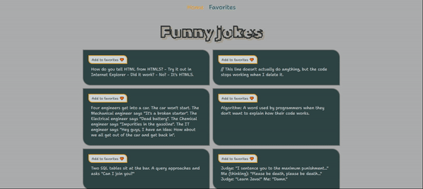

## Jokes app
Project assignment:
* to fetch jokes from API on page load;
* to create functionality for adding jokes to favorites (sending jokes to MongoDB);
* to fetch jokes from the database to the favorite jokes route;
* to create functionality to remove jokes from favorites



## To start the project run:

```sh
npm install
```

```sh
npm run dev
```

Repository of database:
https://github.com/Ieieieva/Vue_Jokes-DB

```sh
npm install
```

```sh
npm run start:nodemon
```
